# UML - Запись к врачу через мобильное приложение:
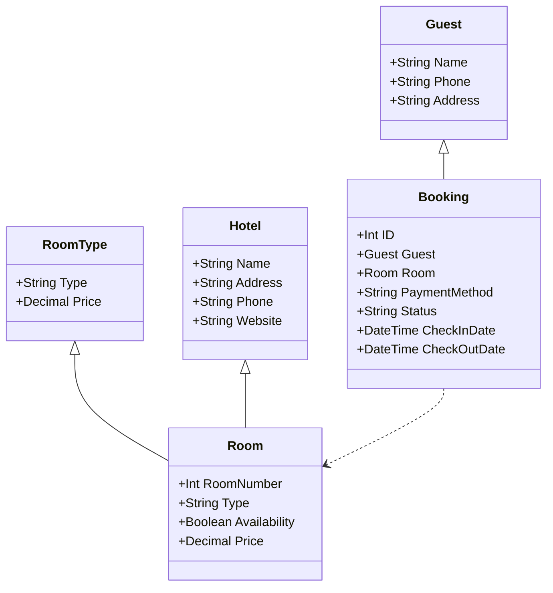
# UML - Заказ такси через мобильое приложение:
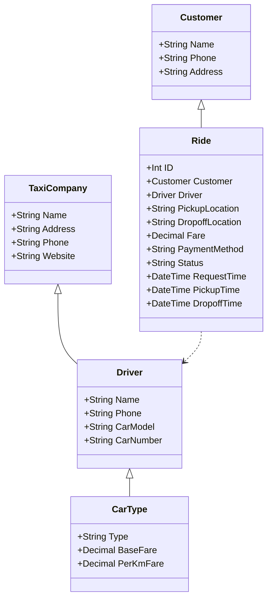
# UML - Запись к врачу через мобильное приложение:
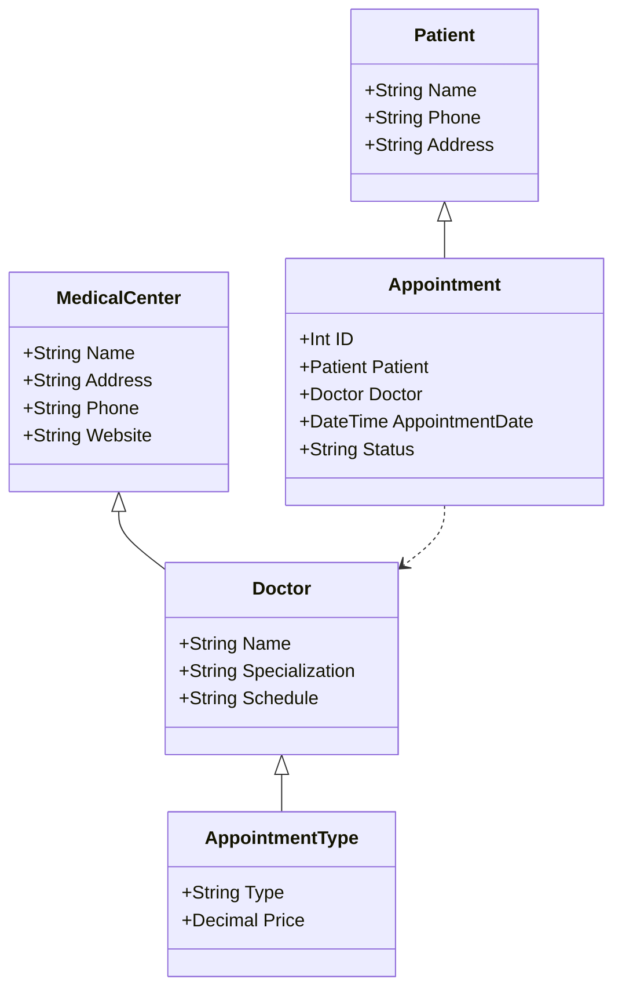
# UML - Покупка тура в турагенстве:
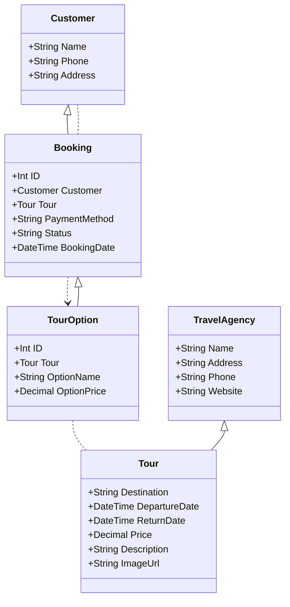
# UML - Создание сайта автомагазина:
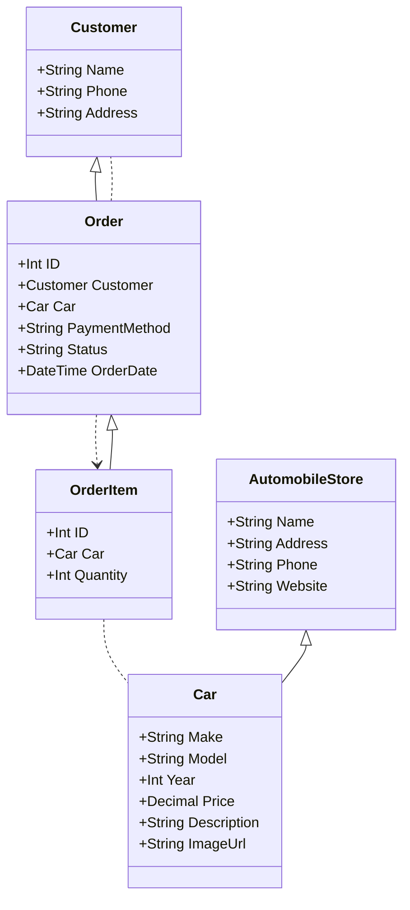
# UML - Оптовая закупка овощей из фермы на склад магазина:
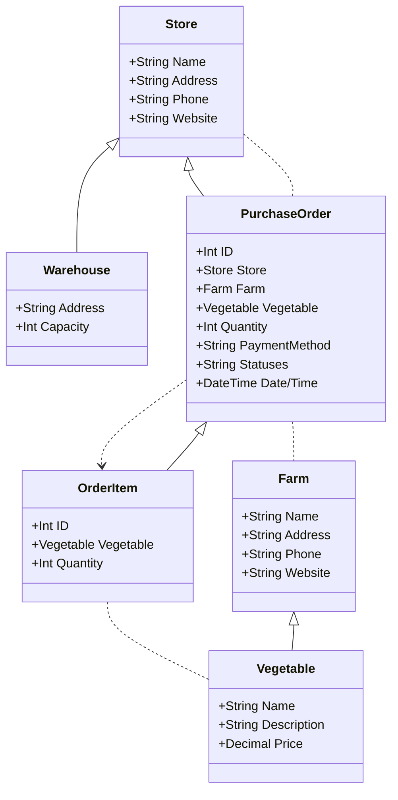
# UML - Заказ шкафа в квартиру с необходимостью вызова замерщика:
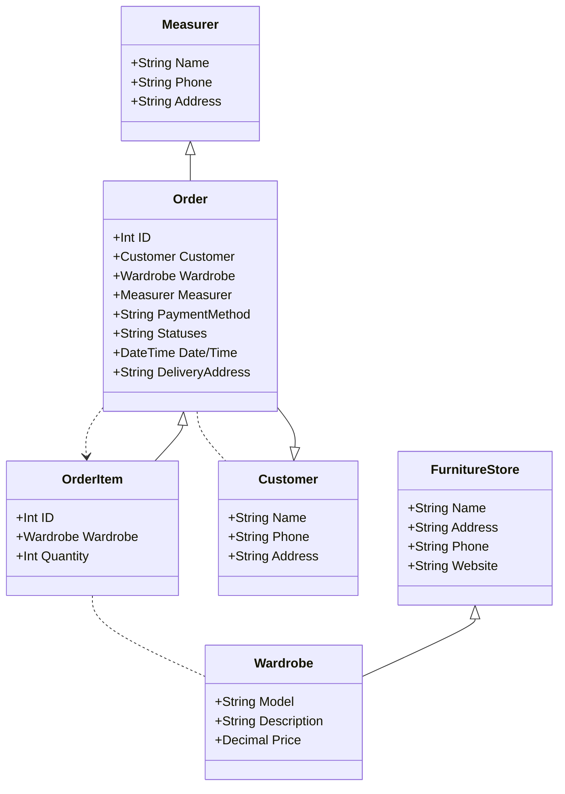
# UML - Заказ продуктов в магазине через мобильное приложение:
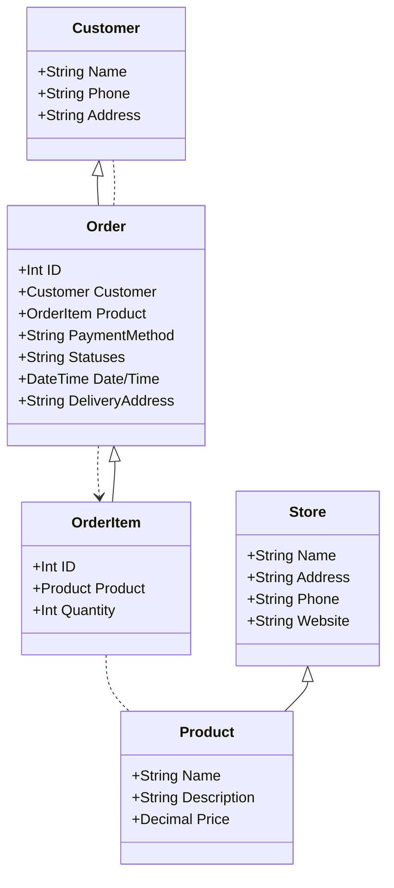
# UML - Оптовая закупка компьютеров в университет:
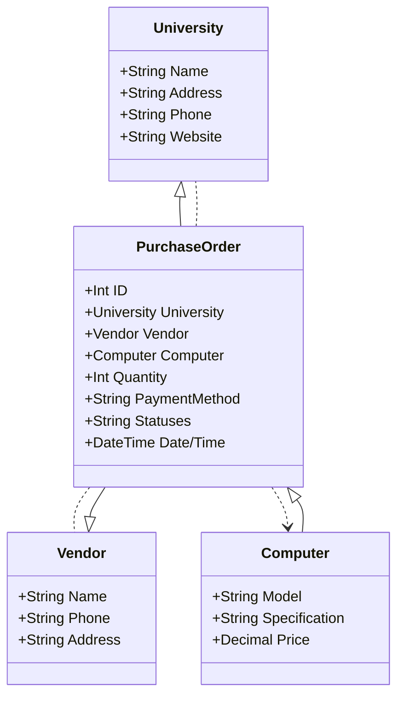
# UML - Прохождение онлай-курсов по программированию:
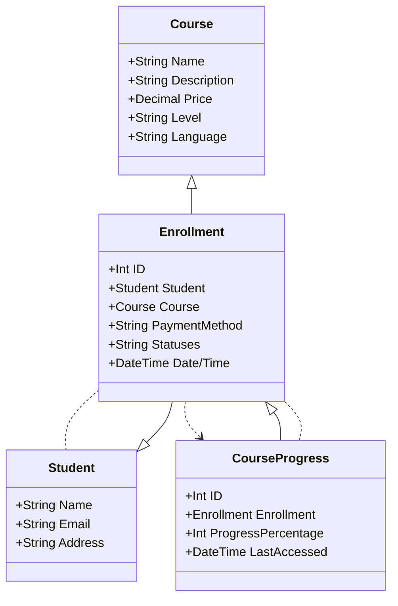
# UML - Заказ и доставка еды из ресторана:
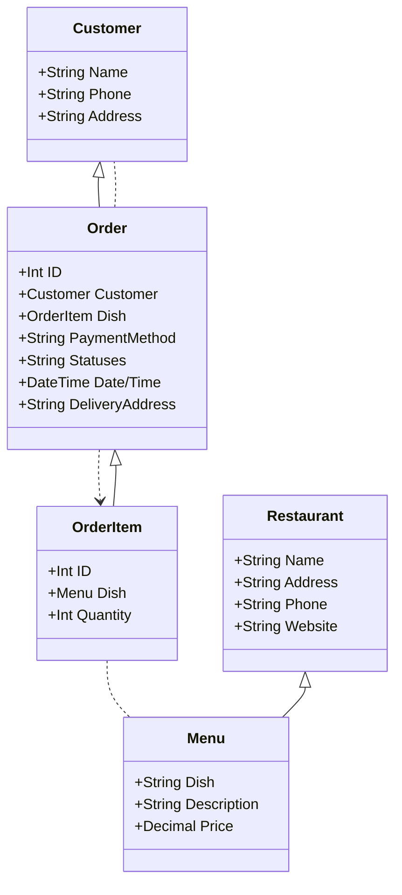
# laboratory_4
